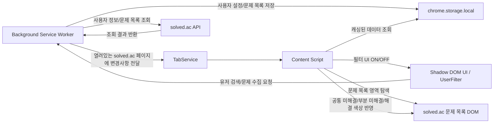

#  unsolved.ac

solved.ac 문제 목록 페이지에서, 여러 사용자의 풀이 상태를 한 번에 비교해
아직 풀지 않은 문제를 빠르게 찾도록 도와주는 Chrome Extension입니다.

## 1) 해결하는 문제

스터디나 팀 단위로 백준 문제를 풀 때 이런 불편이 있습니다.

- 각 사용자 페이지를 번갈아 열어야 해서 시간이 오래 걸림
- 누구는 풀었고 누구는 안 풀었는지를 한 화면에서 보기 어려움

`unsolved.ac`는 solved.ac 문제 목록에 필터 UI를 통해 모두가 안 푼 문제 / 일부만 안 푼 문제 / 모두가 푼 문제를 한 눈에 확인할 수 있습니다.

<br/>

## 2) 주요 기능


- solved.ac 아이디 검색 후 사용자 추가
- 사용자별 문제 수집 진행률 표시
- 사용자 선택/해제에 따라 문제 색상 즉시 변경
- Extension ON/OFF 토글
- 여러 solved.ac 탭 동시 동기화

<br/>

## 3) 빠르게 실행해보기

### 3-1. 방법 A: Chrome Web Store에서 바로 사용

- 설치 링크: [unsolved.ac - Chrome Web Store](https://chromewebstore.google.com/detail/unsolved-ac/hejfoinpncbfalicdommcidjegciodkf)
- 설치 후 브라우저 우측 상단 확장 아이콘에서 `unsolved.ac`를 열어 ON으로 전환하면 바로 사용할 수 있습니다.

### 3-2. 방법 B: 직접 빌드해서 로컬 로드

```bash
pnpm install
pnpm build
```

1. [chrome://extensions](chrome://extensions/) 접속
2. 우측 상단 `개발자 모드` 활성화
3. `압축해제된 확장 프로그램을 로드합니다` 클릭
4. 프로젝트의 `dist` 디렉토리 선택

### 3-3. 사용 방법 (공통)

1. [solved.ac 문제 목록 페이지](https://solved.ac/problems)로 이동
2. 확장 프로그램 팝업에서 ON
3. 우측 상단 필터 버튼 클릭 후 사용자 아이디 추가
4. 문제 목록 색상으로 풀이 상태 비교

<br/>

## 4) 프로젝트 구조

```text
src
├─ components/
│  ├─ feature/         # 도메인 기능 단위 컴포넌트
│  └─ ui/              # 공통 UI 컴포넌트
├─ services/
│  ├─ api/             # solved.ac API / chrome message API
│  └─ chrome/          # background script, content script, DOM/스타일 처리
├─ content/            # Shadow DOM에 React 앱 마운트
├─ types/              # 메시지/응답/도메인 타입 정의
├─ utils/              # URL 변경 감지 등 유틸
└─ constants/          # 상수/에러 메시지
```

> 프로젝트를 아래 순서로 읽는 것을 추천합니다.

1. 확장 프로그램 진입점: [`manifest.json`](https://github.com/ppochaco/unsolved.ac/blob/main/manifest.json)
2. 메시지 라우팅: [`src/services/chrome/background-script.ts`](https://github.com/ppochaco/unsolved.ac/blob/main/src/services/chrome/content-script.ts)
3. 페이지 주입/업데이트 흐름: [`src/services/chrome/content-script.ts`](https://github.com/ppochaco/unsolved.ac/blob/main/src/services/chrome/content-script.ts)
4. 사용자 인터랙션: [`src/components/feature/user-filter/UserFilter.tsx`](https://github.com/ppochaco/unsolved.ac/blob/main/src/components/feature/user-filter/UserFilter.tsx)
5. 문제 색상 계산 로직: [`src/services/chrome/content/style.ts`](https://github.com/ppochaco/unsolved.ac/blob/main/src/services/chrome/content/style.ts)

<br/>

## 5) 데이터 흐름



1. 사용자가 확장 화면에서 설정을 바꾸거나 아이디를 추가
2. 확장 서비스가 데이터를 저장하고 열려 있는 solved.ac 페이지를 동기화
3. 페이지 내 필터 기능이 최신 데이터로 UI를 갱신
4. solved.ac 조회 결과를 바탕으로 문제 목록에 상태별 색상을 적용

<br/>

## 6) 권한 안내

> 권한 범위를 최소화해, 필요한 페이지와 데이터에만 접근하도록 구성했습니다.

- `storage`: 확장 ON/OFF 상태, 사용자 목록, 사용자별 문제 ID 저장
- `host_permissions: https://solved.ac/problems*`: solved.ac 문제 목록 페이지에서만 동작
- 로그인/인증 토큰을 수집하지 않습니다.
- 사용자 설정 데이터는 `chrome.storage.local`에 저장됩니다.
- 외부 전송 데이터는 solved.ac 공개 API 조회 요청(사용자 정보/문제 목록)으로 제한됩니다.
